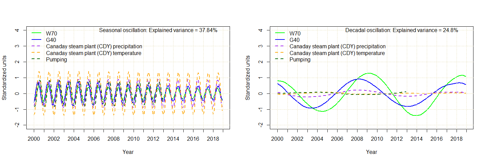
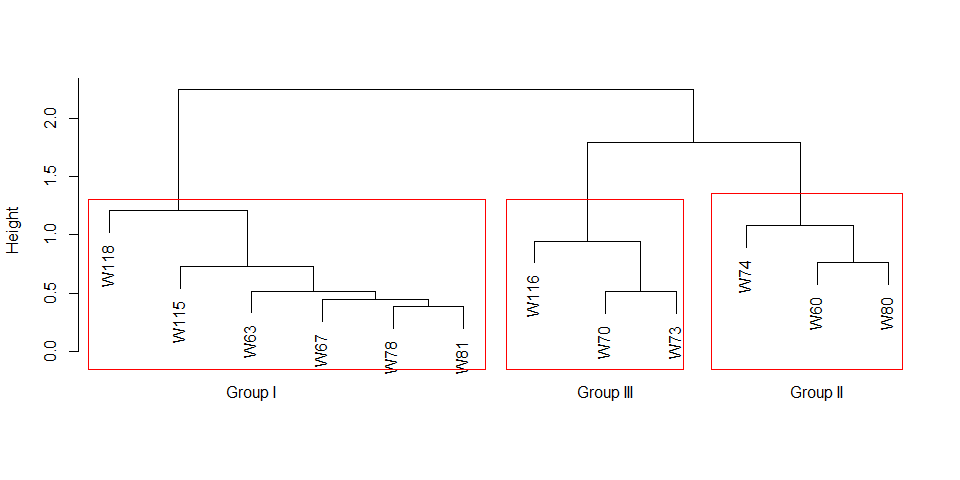
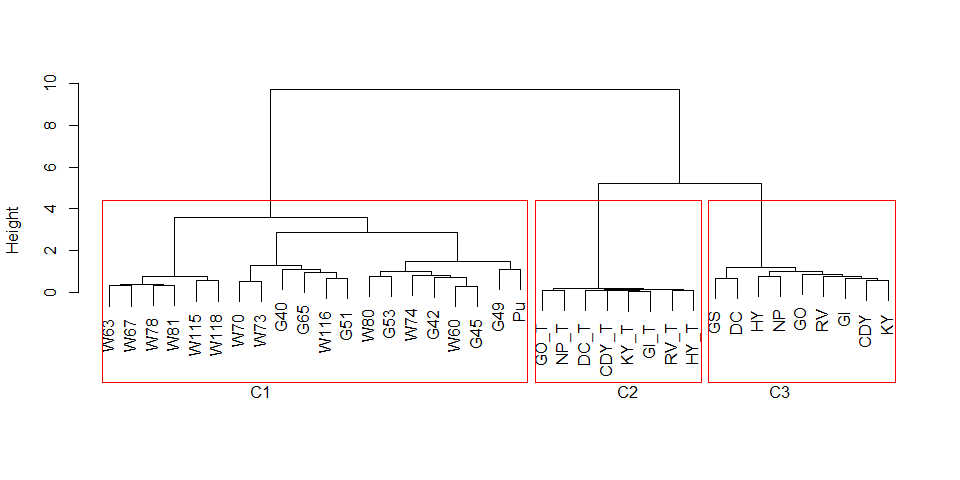
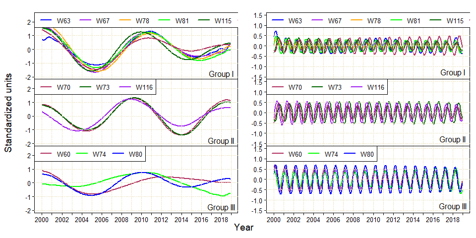

Here is a plot comparing the decadal and seasonal oscillations in the
variables of the subgroup of W70 well.

    par(mfrow = c(1, 2))

    ## Loop around seasonal and decadal oscillations
    for (j in 1:2){
        # Assign filepath for each subgroup
        assign(paste0("filepath",j),Sys.glob(path=paste0("Approach_II/MSSA_Work/W70_RC",
                                                         sprintf("%02d",as.numeric(j)),".csv")))
        # Read RC files for decadal and seasonal in each subgroup
        assign(paste0("F",j),read.csv(file=get(paste0("filepath",j)),header = TRUE))
        
        ## Loop around each variable 
        for (k in 1:length(list)){
            # Create time series object for each variable
            assign(paste0(list[k],".ts"),ts(get(paste0("F",j))[,k+1],start=c(2000,1),end=c(2018,12),
                                            frequency = 12))
        }
        
        ## Plot time series of all variables for decadal and seasonal separately
        ts.plot(W.ts,G.ts,P.ts,T.ts,Pu.ts,
                gpars = list(xlab="Year",ylab="Standardized units",xaxt="n",ylim=c(-2,4),
                             col=c("green","blue","purple","orange","dark green"),lty=c(1,1,2,2,2,3),lwd=c(2,2,2,2,2,3)))
        
        year.text=c("2000","2001","2002","2003","2004","2005","2006","2007",
                    "2008","2009","2010","2011","2012","2013","2014","2015","2016","2017","2018","2019")
        axis(1,at=seq(2000,2019,1),labels=year.text)
        abline(v=seq(2000,2019,1),lty = 6, col = "cornsilk2")
        grid (NA,NULL, lty = 6, col = "cornsilk2")
        
        
        legend('topleft',legend=variableList[[4]],
               col=c("green","blue","purple","orange","dark green"),lty=c(1,1,2,2,2,3),lwd=c(2,2,2,2,2,3),cex=1,bty ="n")
        text(2012.5,4,paste0(osc[j]," oscillation: Explained variance = ",var_explained[[j]][[4]],"%"),cex=1,font = 1)
    }  

Cluster analysis
----------------

A heirarchical cluster anaysis was conducted on the groundwater levels
in the wells. This resulted in a groups division of wells.

    # Prepare data
    W <- read.csv("Data_Processing/GWLevel_imputed.csv", sep=",")[-1]
    S <- read.csv("Data_Processing/SW_imputed.csv", sep=",")[-1]
    P <- read.csv("Data_Processing/Precipitation_imputed.csv", sep=",")[-1]
    Tm <- read.csv("Data_Processing/Temperature_imputed.csv", sep=",")[-1]
    Pu <- -read.csv("Data_Processing/Pumping.csv", sep=",")[-1]

    #Combining all variables
    All <- data.frame(W,S,P,Tm)
    All$Pu <- c(unlist(Pu),rep(NA, nrow(All)-nrow(Pu)))
    head(All)

    ##        W60      W63      W67      W70      W73      W74      W78      W80
    ## 1 2200.452 2282.330 2045.680 2396.298 2410.710 2479.669 1911.284 2541.000
    ## 2 2200.377 2282.340 2045.752 2396.306 2410.502 2479.520 1911.228 2541.000
    ## 3 2200.238 2282.334 2045.837 2396.404 2410.327 2479.101 1911.197 2541.000
    ## 4 2200.110 2282.341 2045.960 2396.086 2410.142 2478.879 1911.148 2540.774
    ## 5 2199.762 2282.123 2046.076 2395.895 2410.179 2478.191 1911.110 2540.548
    ## 6 2199.552 2281.595 2045.607 2395.996 2410.572 2477.632 1910.794 2539.839
    ##      W81     W115     W116     W118      G40      G42      G45      G49
    ## 1 1932.0 1765.232 1667.225 1508.000 3.938065 4.795928 4.130000 2.579355
    ## 2 1932.0 1765.202 1667.190 1507.862 3.950000 6.247735 4.120690 2.623103
    ## 3 1932.0 1765.205 1667.298 1507.000 3.872581 5.337179 3.939032 2.561290
    ## 4 1932.0 1765.192 1667.375 1507.000 3.892000 4.992115 3.678000 2.361000
    ## 5 1932.0 1765.112 1667.318 1507.000 4.330000 3.978221 3.471935 2.136129
    ## 6 1930.5 1765.068 1667.260 1506.871 4.515000 3.513387 3.262000 1.943333
    ##        G51      G53      G65   RV  CDY   KY   HY   GI   GS   GO   NP   DC RV_T
    ## 1 4.456774 4.669355 4.177097 0.41 1.39 0.53 0.17 0.25 0.18 0.16 0.12 0.10 30.1
    ## 2 4.493103 4.745769 4.182069 1.37 1.39 1.79 0.97 1.35 0.96 0.18 0.18 0.34 36.3
    ## 3 4.521111 4.646452 4.227419 1.07 1.62 2.19 1.61 1.32 1.33 0.65 0.46 0.58 43.9
    ## 4 4.496333 4.515000 4.302667 1.95 1.73 1.12 1.54 1.60 1.10 1.15 0.81 0.42 52.0
    ## 5 4.428387 4.308710 4.159677 1.81 1.60 2.68 0.39 2.19 2.61 0.76 0.52 1.07 64.7
    ## 6 4.157000 3.956667 4.114667 2.03 1.95 3.63 1.04 0.70 2.69 1.00 1.12 1.29 70.4
    ##   CDY_T KY_T HY_T GI_T GO_T NP_T DC_T         Pu
    ## 1  29.9 28.4 31.2 28.1 42.1 41.6 27.8   -5292734
    ## 2  35.9 33.4 35.8 34.7 48.7 47.8 37.0   -4789253
    ## 3  43.4 41.6 43.4 42.5 55.1 54.1 44.5   -5612045
    ## 4  49.8 48.6 50.6 50.1 65.4 65.7 51.8  -90082913
    ## 5  62.7 62.2 63.3 64.1 75.6 75.5 66.1 -150906056
    ## 6  69.3 68.4 68.9 70.3 83.3 84.1 71.0 -623481138

    #Selecting variables for cluster analysis
    onlyWells <- scale(All[,1:12])
    allVar <- scale(All[1:156,])

    #Using Pearson's correlation coeffiecint for oly groundwater levels
    cordat<-diss(t(onlyWells), "COR")
    hc<-hclust(cordat, method="ward.D")
    plot(hc,main=" ",sub =" ",xlab = " ")
    rect(0.7,-0.15,6.3,1.3,border =  "red")
    rect(6.6,-0.15,9.1,1.3,border =  "red")
    rect(9.5,-0.15,12.2,1.35,border =  "red")
    mtext('Group I',side = 1,at = 3)
    mtext('Group III',side = 1,at = 8)
    mtext('Group II',side = 1,at = 11)

Now, all the variables can also be plotted to understand the
relationship between the variables.

    cordat<-diss(t(allVar), "COR")
    hc<-hclust(cordat, method="ward.D")
    plot(hc,main=" ",sub =" ",xlab = " ")
    rect.hclust(hc, k=3,border = 'red', )
    mtext('C1',side = 1,at = 8)
    mtext('C2',side = 1,at = 25)
    mtext('C3',side = 1,at = 32)

These groups obtained from cluster analysis can be compared using
decadal ans seasonal oscillations from MSSA.

