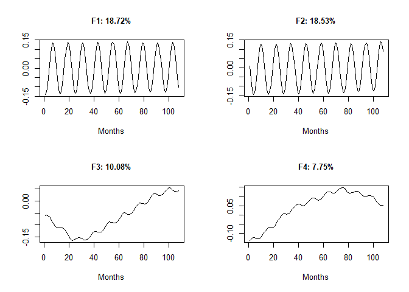
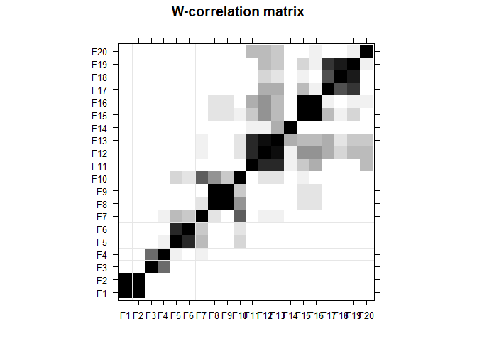

    if (!require('Rssa')) install.packages('Rssa'); library('Rssa')

    ## Loading required package: Rssa

    ## Loading required package: svd

    ## Loading required package: forecast

    ## Registered S3 method overwritten by 'quantmod':
    ##   method            from
    ##   as.zoo.data.frame zoo

    ## 
    ## Attaching package: 'Rssa'

    ## The following object is masked from 'package:stats':
    ## 
    ##     decompose

Preparing the set of variables
------------------------------

The first task in Approach II is to set subgroups of variables such as
groundwater wells, gauge stations, weather stations and pumping,
grouping the stations that are close in proximity grographically. Here,
we had a group of 12 sets of variables based on the location of each
ground water wells. In this document, only the code for one subgroup is
being shown since the codes for all the groups are similar.

    #Gather all required variable files
    GW<-read.csv(file ="Data_Processing/GWLevel_imputed.csv",header = TRUE) [-1] 
    SW<-read.csv(file ="Data_Processing/SW_imputed.csv",header = TRUE) [-1] 
    Pr<-read.csv(file ="Data_Processing/Precipitation_imputed.csv",header = TRUE)[-1] 
    Tmp<-read.csv(file ="Data_Processing/Temperature_imputed.csv",header = TRUE)[-1] 
    Pmp<-read.csv(file ="Data_Processing/Pumping.csv",header = TRUE)[-1]

    #The sets are named on the basis of groundwater well in the area
    w60Gp <- data.frame(GW[,1],SW[,2],Pr[,3],Tmp[,3],c(unlist(Pmp),rep(NA, nrow(GW)-nrow(Pmp)))) ; #W60,G42,KY
    colnames(w60Gp) <- c("W60","G42","KY_P","KY_T","Pumping") 
    head(w60Gp)

    ##        W60      G42 KY_P KY_T   Pumping
    ## 1 2200.452 4.795928 0.53 28.4   5292734
    ## 2 2200.377 6.247735 1.79 33.4   4789253
    ## 3 2200.238 5.337179 2.19 41.6   5612045
    ## 4 2200.110 4.992115 1.12 48.6  90082913
    ## 5 2199.762 3.978221 2.68 62.2 150906056
    ## 6 2199.552 3.513387 3.63 68.4 623481138

This is the data containing data from the subgroup containing W60 well.
This data is then used for MSSA operation, for which guidance from
(Golyandina et al. [2013](#ref-golyandina2013multivariate)) and (Hassani
and Mahmoudvand [2013](#ref-hassani2013multivariate)) were taken. Rssa
package (Golyandina et al. [2015](#ref-Rssa2015)) was used for
multivariate singular spectrum analysis (MSSA).

    Data<-scale(read.csv(file ="Approach_II/MSSA_Work/W60_variables_set.csv",header = TRUE)[-1])

Selecting a window length is somewhat of an iterative process where we
select a window length and check if it gives us better separability
result. Here, following suggestion in (Golyandina et al.
[2013](#ref-golyandina2013multivariate)), a window length close to half
of the number of observations, and a number divisible by the cycle
length (12 in this case) was taken.

    L=108 #Assume window length close to N/2 (N=222 here)
    #Create a ssa object
    s <- ssa(Data, L = L, kind = "mssa")

The eigenvectors from the SVD decomposition in MSSA can be plotted to
give and idea on how to group them later according to type and frequency
of the vector.

    par(mfrow=c(2,2))
    perc <- c("18.72%","18.53%","10.08%","7.75%")
    for(i in 1:4){
            plot(s$U[,i], type="l",ylab =" ",
                 xlab = "Months",main=paste0("F",i,": ",perc[i]),cex.main=1)
    }

The separability of eigenvectors can also be assessed by plotting w
correlation graph, which is defined by (Golyandina et al.
[2013](#ref-golyandina2013multivariate)).

    # Calculate the w-correlation matrix between first 20 series
    # for a guess for grouping
    w <- wcor(s, groups = 1:20)
    plot(w, grid = c(2,4, 5,7))

Using this plot, we can find which eigenvectors have high correations
with each other and can be grouped together to form reconstructed
components (RCs). Here, 10 groups of eigenvectors were selected for
reconstruction of components. Each of these 10 reconstructed components
is supposed to represent a unique characteristics that were embedded in
the multivariate time series.

    r <- reconstruct(s,groups = list(c(1,2),c(3,4),c(5,6),c(7,10),c(8,9),c(11),c(12,14),
                                     c(13,15,18),c(16,17),c(19,20)))

Golyandina, Nina, Anton Korobeynikov, Alex Shlemov, and Konstantin
Usevich. 2013. “Multivariate and 2D Extensions of Singular Spectrum
Analysis with the Rssa Package.” *arXiv Preprint arXiv:1309.5050*.

———. 2015. “Multivariate and 2D Extensions of Singular Spectrum Analysis
with the Rssa Package.” *Journal of Statistical Software* 67 (2): 1–78.
<https://doi.org/10.18637/jss.v067.i02>.

Hassani, Hossein, and Rahim Mahmoudvand. 2013. “Multivariate Singular
Spectrum Analysis: A General View and New Vector Forecasting Approach.”
*International Journal of Energy and Statistics* 1 (01): 55–83.
