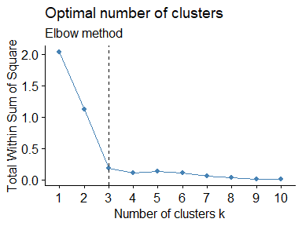
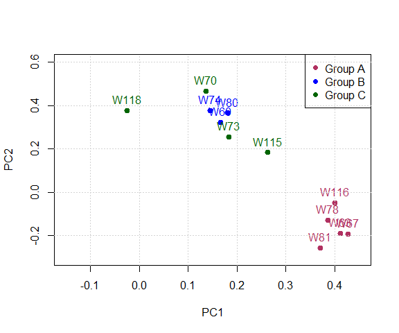
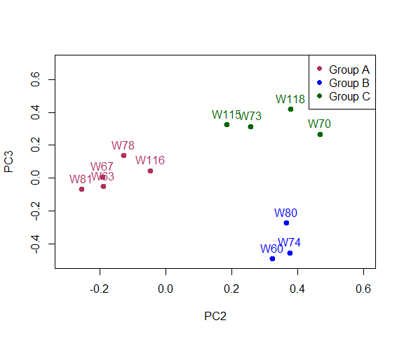
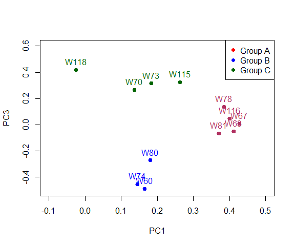
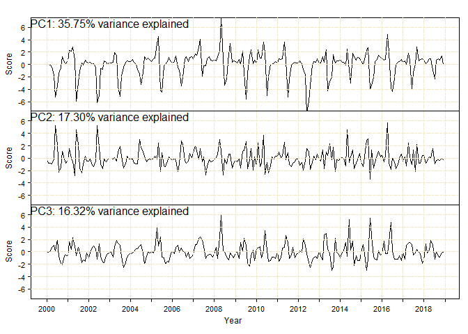
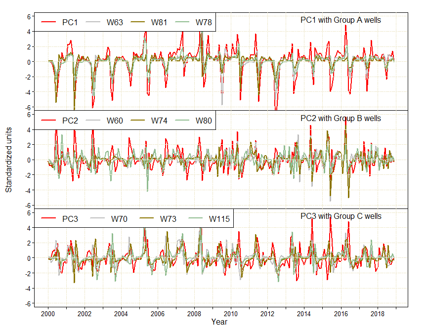

This document consists of two main parts of Approach I: Principal
component analysis and cluster analysis. The data used were first made
stationary by using first degree differencing.

Before beginning, here is a function to plot many time series using
ggplot.We will be using this function in the following lines to plot
stationary time series.

    create_timeseries_plots <- function(df){
      # change into metres
      df <- sapply(as.data.frame(df), function(y) y*0.3048)
      # column with dates
      dates = seq(from = as.Date("2000-02-01"), to = as.Date("2018-12-1"), by = 'month') 
      # add date column to dataframe
      df_m <- data.frame(as.data.frame(df[,-1]),dates)
      colnames(df_m)[ncol(df_m)]<-"Date"
      library(reshape2)
      library(ggplot2)
      library(dplyr)
      # Rearrange dataframe to long form
      df_m2 <- melt(df_m, id.vars = "Date", 
                    variable.name = "Var", value.name="Val")
      # Group the dataframe
      df_m3 <- df_m2%>%
        group_by(Date,Var)
      #Plot using ggplot2
      ggplot(data = df_m3,aes(x = Date, y = Val)) + 
        geom_line() + facet_wrap(~ Var, nrow = 6, scales = "free") +
        xlab("Year") + ylab("Units(m)") + theme_bw()
    }

Converting time series to stationary
====================================

In this approach, the time series data is made stationary using first
differencing methods. For testing stationarity, Augmented Dickey-Fuller
(ADF) t-statistic test for unit root was used.

    GWData<-read.csv(file ="Data_Processing/GWLevel_imputed.csv",header = TRUE)  
    head(GWData)

    ##   X      W60      W63      W67      W70      W73      W74      W78      W80
    ## 1 1 2200.452 2282.330 2045.680 2396.298 2410.710 2479.669 1911.284 2541.000
    ## 2 2 2200.377 2282.340 2045.752 2396.306 2410.502 2479.520 1911.228 2541.000
    ## 3 3 2200.238 2282.334 2045.837 2396.404 2410.327 2479.101 1911.197 2541.000
    ## 4 4 2200.110 2282.341 2045.960 2396.086 2410.142 2478.879 1911.148 2540.774
    ## 5 5 2199.762 2282.123 2046.076 2395.895 2410.179 2478.191 1911.110 2540.548
    ## 6 6 2199.552 2281.595 2045.607 2395.996 2410.572 2477.632 1910.794 2539.839
    ##      W81     W115     W116     W118
    ## 1 1932.0 1765.232 1667.225 1508.000
    ## 2 1932.0 1765.202 1667.190 1507.862
    ## 3 1932.0 1765.205 1667.298 1507.000
    ## 4 1932.0 1765.192 1667.375 1507.000
    ## 5 1932.0 1765.112 1667.318 1507.000
    ## 6 1930.5 1765.068 1667.260 1506.871

Now, loop around each column in the dataframe to obtain a dataframe
containing first degree differenced values.

This above procedure were also used to create stationary time series of
stream stage, precipitation, and pumping. Below is the plot showing the
stationary time series. Please note that the units are differences of
water levels between a month and preceding month, therefore the negative
values in some cases.

    create_timeseries_plots(diff_gw)

    ## 
    ## Attaching package: 'dplyr'

    ## The following objects are masked from 'package:stats':
    ## 
    ##     filter, lag

    ## The following objects are masked from 'package:base':
    ## 
    ##     intersect, setdiff, setequal, union

Principal Component Analysis
============================

### Check suitability of PCA

    #First compute correlation matrix
    GWDataCor <- cor(GWData)

We now examine the data to assess whether the assumptions for PCA have
been met before proceeding. For this, instructions from (Field, Miles,
and Field [2012](#ref-field2012discovering)) were used. We use the paf()
function from the rela package (Chajewski [2009](#ref-R-rela)).

To test for the first assumption, Bartlett’s Test for Sphericity was
performed. The null hypothesis for this test is that the
intercorrelation matrix comes from a noncollinear populaton or simply
that there is nocollinearity between the variables, which would render
PCA impossible as it depends on the construction of a linear combination
of the variables. We use a significance level α=.05.

    bartlettTest <- cortest.bartlett(GWDataCor)
    bartlettTest

    ## $chisq
    ## [1] 1554.5
    ## 
    ## $p.value
    ## [1] 3.9534e-273
    ## 
    ## $df
    ## [1] 78

Bartlett test is rejected because p values is less than 0.01. Now we
will extract Kaiser-Meyer-Olkin (KMO) from the assumptions object.

    print(assumptions$KMO)

    ## [1] 0.78196

This value is more than 0.7, so can be acceptable.

    det(GWDataCor)

    ## [1] 6.3884e-08

The determinant is positive, hence it satisfies all three assumptions of
PCA. Therefore, we can proceed with PCA.

### Analyzing correlation matrix

The correlation matrix is shown graphically. This following plot gives a
prelimminary insight on the relationship between the groundwater levels
in wells.

    cor.mat <- round(cor(GWData),2)
    corrplot(cor.mat, type="upper", order="hclust", 
             tl.col="black", tl.srt=45)

### Performing PCA

PCA analysis operation was followed step by step from (Kassambara
[2017](#ref-kassambara2017practical)) and
[link](http://www.sthda.com/english/wiki/print.php?id=202). The data is
first standardized by centering and scaling.

    GWData<-scale(GWData)

Now, FactoMine package (Lê, Josse, and Husson
[2008](#ref-FactoMineR2008)) is used to perform PCA.

    res.pca <- PCA(GWData, graph = F)

The above screeplot shows that three components are dominant in the
data. Therefore, we will use three principal components. The variables
can also be shown in a base graph showing contribution levels of each
well along with information on the alignment of each well on principal
components.

    fviz_pca_var(res.pca, col.var="contrib")+ 
      scale_color_gradient2(low="white",mid="blue",high="red", midpoint=2.5)+theme_bw()

### Output

The main output of PCA are PC scores and PC loadings.

    loadings<-sweep(res.pca$var$coord,2,sqrt(res.pca$eig[1:ncol(res.pca$var$coord),1]),FUN="/")
    scores <- res.pca$ind$coord

Loadings:

    head(loadings)

    ##        Dim.1     Dim.2     Dim.3     Dim.4    Dim.5
    ## X   0.014111  0.547516  0.452468  0.181212  0.28732
    ## W60 0.237964 -0.023761  0.166657  0.559119 -0.40817
    ## W63 0.336960 -0.218572  0.056062 -0.106129  0.11953
    ## W67 0.340361 -0.182082  0.178734 -0.096072  0.24309
    ## W70 0.263430  0.326685 -0.384239 -0.154580 -0.25646
    ## W73 0.256491  0.232868 -0.418522 -0.241523 -0.27304

Scores:

    head(scores)

    ##    Dim.1   Dim.2   Dim.3     Dim.4     Dim.5
    ## 1 4.7568 -3.0017 0.32577  0.308082 -0.300217
    ## 2 4.6656 -2.9989 0.39249  0.214086 -0.243013
    ## 3 4.4880 -2.9471 0.36619 -0.035638 -0.087393
    ## 4 4.2597 -3.0189 0.55002 -0.289533  0.124108
    ## 5 3.8887 -2.9178 0.77289 -0.978796  0.268168
    ## 6 3.2516 -2.6605 0.72420 -1.772507  0.266751

Cluster Analysis
================

Loadings from PCA was used in cluster analysis.

    ldfile<-read.csv(file = "Approach_I/PC_loadings.csv",header = T)
    selectedData<-ldfile[,2:4]
    row.names(selectedData)<-c("W60","W63","W67","W70","W73","W74","W78","W80","W81","W115",
                               "W116","W118")
    selectedData

    ##          Dim.1     Dim.2      Dim.3
    ## W60   0.165426  0.323885 -0.4906888
    ## W63   0.411455 -0.189212 -0.0506042
    ## W67   0.426939 -0.192569  0.0068236
    ## W70   0.136264  0.467111  0.2664983
    ## W73   0.182949  0.256871  0.3146377
    ## W74   0.144564  0.376994 -0.4538613
    ## W78   0.385414 -0.128162  0.1359096
    ## W80   0.180484  0.366425 -0.2726035
    ## W81   0.370337 -0.256314 -0.0680691
    ## W115  0.262490  0.184421  0.3241264
    ## W116  0.400386 -0.048097  0.0460384
    ## W118 -0.025431  0.378418  0.4195401

Elbow method to find optimal number of clusters:

    fviz_nbclust(selectedData, kmeans, method = "wss") +
      geom_vline(xintercept = 3, linetype = 2)+
      labs(subtitle = "Elbow method")

Using heirarchical clustering:

    distanceData = dist(selectedData, method="euclidean")
    hclustData<-hclust(distanceData,method="ward.D")
    plot(hclustData,main=" ",sub="Heirarchical clustering",xlab=" ")
    rect.hclust(hclustData, k=3,border = "red")
    mtext('Group A',side = 1,at = 3)
    mtext('Group B',side = 1,at = 7)
    mtext('Group C',side = 1,at = 10)

Using k-means clustering:

    kmeansData<-kmeans(selectedData,3) 
    ClusterData<-kmeansData$cluster

Now, plotting loadings of PC1 against P2, PC2 against PC3, and PC3
against PC1

    palette(c("maroon","blue","dark green"))
    plot(selectedData[,1],selectedData[,2],ylim=c(-0.3,0.6),xlim=c(-0.15,0.45),
         xlab="PC1",ylab="PC2",pch=19,cex=1,lty='solid',lwd=2,col= ClusterData)
    text(selectedData[,c(1,2)],labels=rownames(selectedData),cex=1,pos=3,col= ClusterData)
    legend('topright',legend=c("Group A","Group B","Group C"),col=c("maroon","blue","dark green"),pch=19,
           cex=1,bty="y")
    grid()

    plot(selectedData[,2],selectedData[,3],ylim=c(-0.5,0.7),xlim=c(-0.3,0.6),
         xlab="PC2",ylab="PC3",pch=19,cex=1,lty='solid',lwd=2,col= ClusterData)
    text(selectedData[,c(2,3)],labels=rownames(selectedData),cex=1,pos=3,col= ClusterData)
    legend('topright',legend=c("Group A","Group B","Group C"),col=c("maroon","blue","dark green"),pch=19,
           cex=1,bty="y")

    plot(selectedData[,1],selectedData[,3],ylim=c(-0.5,0.6),xlim=c(-0.1,0.5),
         xlab="PC1",ylab="PC3",pch=19,cex=1,lty='solid',lwd=2,col= ClusterData)
    text(selectedData[,c(1,3)],labels=rownames(selectedData),cex=1,pos=3,col= ClusterData)
    legend('topright',legend=c("Group A","Group B","Group C"),col=c("red","blue","dark green"),pch=19,
           cex=1,bty="y")

Comparison of principal components and groundwater wells
========================================================

The principal components can be compared with the groundwater wells to
validate the cluster analysis above. First, all the variables need to be
transformed into time series form.

    Scores <- read.csv(file = "Approach_I/PC_scores.csv",header = T)[-1]
    W <- scale(read.csv("Approach_I/GWLevels_stationary.csv", sep=","))
    S <- scale(read.csv("Approach_I/SW_stationary.csv", sep=","))
    P <- scale(read.csv("Approach_I/Precipitation_stationary.csv", sep=","))
    Pu <- read.csv("Approach_I/Pumping_stationary.csv", sep=",")

    #PC time series
    pc1.ts<-ts(Scores[,1],start=c(2000,1),end=c(2018,12),frequency = 12)
    pc2.ts<-ts(Scores[,2],start=c(2000,1),end=c(2018,12),frequency = 12)
    pc3.ts<-ts(Scores[,3],start=c(2000,1),end=c(2018,12),frequency = 12)

    #Wells time series
    w60.ts<-ts(W[,2],start=c(2000,1),end=c(2018,12),frequency = 12)
    w63.ts<-ts(W[,3],start=c(2000,1),end=c(2018,12),frequency = 12) 
    w67.ts<-ts(W[,4],start=c(2000,1),end=c(2018,12),frequency = 12) 
    w70.ts<-ts(W[,5],start=c(2000,1),end=c(2018,12),frequency = 12) 
    w73.ts<-ts(W[,6],start=c(2000,1),end=c(2018,12),frequency = 12) 
    w74.ts<-ts(W[,7],start=c(2000,1),end=c(2018,12),frequency = 12) 
    w78.ts<-ts(W[,8],start=c(2000,1),end=c(2018,12),frequency = 12) 
    w80.ts<-ts(W[,9],start=c(2000,1),end=c(2018,12),frequency = 12) 
    w81.ts<-ts(W[,10],start=c(2000,1),end=c(2018,12),frequency = 12) 
    w115.ts<-ts(W[,11],start=c(2000,1),end=c(2018,12),frequency = 12) 
    w116.ts<-ts(W[,12],start=c(2000,1),end=c(2018,12),frequency = 12) 
    w118.ts<-ts(W[,13],start=c(2000,1),end=c(2018,12),frequency = 12) 

    #Streams time series
    g40.ts<-ts(S[,2],start=c(2000,1),end=c(2018,12),frequency = 12)
    g42.ts<-ts(S[,3],start=c(2000,1),end=c(2018,12),frequency = 12)
    g45.ts<-ts(S[,4],start=c(2000,1),end=c(2018,12),frequency = 12)
    g49.ts<-ts(S[,5],start=c(2000,1),end=c(2018,12),frequency = 12)
    g51.ts<-ts(S[,6],start=c(2000,1),end=c(2018,12),frequency = 12)
    g53.ts<-ts(S[,7],start=c(2000,1),end=c(2018,12),frequency = 12)
    g65.ts<-ts(S[,8],start=c(2000,1),end=c(2018,12),frequency = 12)

    #Precipitation time series
    rv.ts<-ts(P[,2],start=c(2000,1),end=c(2018,12),frequency = 12)
    cdy.ts<-ts(P[,3],start=c(2000,1),end=c(2018,12),frequency = 12)
    ky.ts<-ts(P[,4],start=c(2000,1),end=c(2018,12),frequency = 12)
    hy.ts<-ts(P[,5],start=c(2000,1),end=c(2018,12),frequency = 12)
    gi.ts<-ts(P[,6],start=c(2000,1),end=c(2018,12),frequency = 12)
    gs.ts<-ts(P[,7],start=c(2000,1),end=c(2018,12),frequency = 12)
    go.ts<-ts(P[,8],start=c(2000,1),end=c(2018,12),frequency = 12)
    np.ts<-ts(P[,9],start=c(2000,1),end=c(2018,12),frequency = 12)
    dc.ts<-ts(P[,10],start=c(2000,1),end=c(2018,12),frequency = 12)

    #Pumping time series
    pum.ts<-ts(Pu[,2],start=c(2000,1),end=c(2013,12),frequency = 12)

Here is a plot showing the PC scores:

    #Plot PC scores
    par(mfrow=c(3,1), mar=c(0,3.5,0,1), oma=c(4,0,2,0), mgp=c(2,.6,0), cex.lab=1.1, tcl=-.3, las=1)
    #Group1
    ts.plot(pc1.ts,
            gpars = list(xlab="Year",ylab="Score",cex=1,xaxt="n"),ylim=c(-7,7),
            col=c("black"),lwd=c(1,2,2,2),lty=c(1,1,1,1,1,1))
    abline(v=seq(2000,2019,1),lty = 6, col = "cornsilk2")
    #abline(v=seq(2000,2019,1/12),lty = 3,lwd=0.01, col = "cornsilk2")
    grid (NA,NULL, lty = 6, col = "cornsilk2")
    text(2003,6.5,"PC1: 35.75% variance explained",cex=1.5,bty="n")

    #Group2
    ts.plot(pc2.ts,
            gpars = list(xlab="Year",ylab="Score",cex=1,xaxt="n"),ylim=c(-7,7),
            col=c("black"),lwd=c(1,2,2,2),lty=c(1,1,1,1,1,1))
    abline(v=seq(2000,2019,1),lty = 6, col = "cornsilk2")
    #abline(v=seq(2000,2019,1/12),lty = 3,lwd=0.01, col = "cornsilk2")
    grid (NA,NULL, lty = 6, col = "cornsilk2")
    text(2003,6.6,"PC2: 17.30% variance explained",cex=1.5,bty="n")

    #Group3
    ts.plot(pc3.ts,
            gpars = list(xlab="Year",ylab="Score",cex=1,xaxt="n"),ylim=c(-7,7),
            col=c("black"),lwd=c(1,2,2,2),lty=c(1,1,1,1,1,1))
    abline(v=seq(2000,2019,1),lty = 6, col = "cornsilk2")
    #abline(v=seq(2000,2019,1/12),lty = 3,lwd=0.01, col = "cornsilk2")
    grid (NA,NULL, lty = 6, col = "cornsilk2")
    text(2003,6.6,"PC3: 16.32% variance explained",cex=1.5,bty="n")

    year.text=c("2000","2001","2002","2003","2004","2005","2006","2007","2008","2009","2010","2011","2012","2013",
                "2014","2015","2016","2017","2018","2019")
    axis(1,at=seq(2000,2019,1),labels=year.text)
    title(xlab="Year", outer=TRUE)

Now, the wells having correlations with each PC are plotted with the
respective PC.

    par(mfrow=c(3,1), mar=c(0,3.5,0,3), oma=c(4,2,2,0), mgp=c(2,.6,0), cex.lab=1.5, tcl=-.3, las=1)

    #PC1
    ts.plot(pc1.ts,w63.ts,w81.ts,w78.ts,
            gpars = list(xlab=" ",ylab=" ",cex=1,xaxt="n",yaxt ="n"),ylim=c(-6,6),
            col=c("red","gray","gold4","darkseagreen"),lwd=c(2,2,2,2),lty=c(1,1,1,1))
    axis(2,cex.axis=1.2)

    abline(v=seq(2000,2019,1),lty = 6, col = "cornsilk2")
    grid (NA,NULL, lty = 6, col = "cornsilk2")
    legend('topleft',horiz = TRUE,legend=c("PC1","W63","W81","W78"),
           col=c("red","gray","gold4","darkseagreen"),lwd=c(2,2,2,2),lty=c(1,1,1,1),cex=1.5,bty="y")
    text(2016,5.5,"PC1 with Group A wells",cex=1.5,bty="n",font=1)

    #PC2
    ts.plot(pc2.ts,w60.ts,w74.ts,w80.ts,
            gpars = list(xlab=" ",ylab=" ",xaxt="n",yaxt ="n"),ylim=c(-6,6),
            col=c("red","gray","gold4","darkseagreen"),lwd=c(2,2,2,2),lty=c(1,1,1,1))

    abline(v=seq(2000,2019,1),lty = 6, col = "cornsilk2")
    grid (NA,NULL, lty = 6, col = "cornsilk2")
    legend('topleft',horiz = TRUE,legend=c("PC2","W60","W74","W80"),
           col=c("red","gray","gold4","darkseagreen"),lwd=c(2,2,2,2),lty=c(1,1,1,1),cex=1.5,bty="y")
    text(2016,5.5,"PC2 with Group B wells",cex=1.5,bty="n",font=1)
    axis(2,cex.axis=1.2)

    #PC3
    ts.plot(pc3.ts,w70.ts,w73.ts,w115.ts,
            gpars = list(xlab=" ",ylab=" ",cex=1,xaxt="n",yaxt ="n"),ylim=c(-6,6),
            col=c("red","gray","gold4","darkseagreen"),lwd=c(2,2,2,2),lty=c(1,1,1,1))

    abline(v=seq(2000,2019,1),lty = 6, col = "cornsilk2")
    grid (NA,NULL, lty = 6, col = "cornsilk2")
    legend('topleft',horiz = TRUE,legend=c("PC2","W70","W73","W115"),
           col=c("red","gray","gold4","darkseagreen"),lwd=c(2,2,2,2),lty=c(1,1,1,1),cex=1.5,bty="y")
    text(2016,5.5,"PC3 with Group C wells",cex=1.5,bty="n",font=1)
    axis(2,cex.axis=1.2)

    year.text=c("2000","2001","2002","2003","2004","2005","2006","2007","2008","2009","2010","2011","2012","2013",
                "2014","2015","2016","2017","2018","2019")
    axis(1,at=seq(2000,2019,1),labels=year.text,cex.axis = 1.2)

    mtext("Standardized units",side = 2,outer = TRUE,las = 0,cex = 1)
    mtext("Year",side = 1,outer = TRUE,line = 2,cex = 1)

References
==========

Chajewski, Michael. 2009. *Rela: Item Analysis Package with Standard
Errors*. <https://CRAN.R-project.org/package=rela>.

Field, Andy P, Jeremy Miles, and Zoë Field. 2012. “Discovering
Statistics Using R/Andy Field, Jeremy Miles, Zoë Field.” London;
Thousand Oaks, Calif.: Sage,

Kassambara, Alboukadel. 2017. *Practical Guide to Principal Component
Methods in R: PCA, M (ca), Famd, Mfa, Hcpc, Factoextra*. Vol. 2. Sthda.

Lê, Sébastien, Julie Josse, and François Husson. 2008. “FactoMineR: A
Package for Multivariate Analysis.” *Journal of Statistical Software* 25
(1): 1–18. <https://doi.org/10.18637/jss.v025.i01>.
