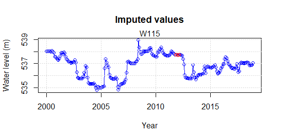
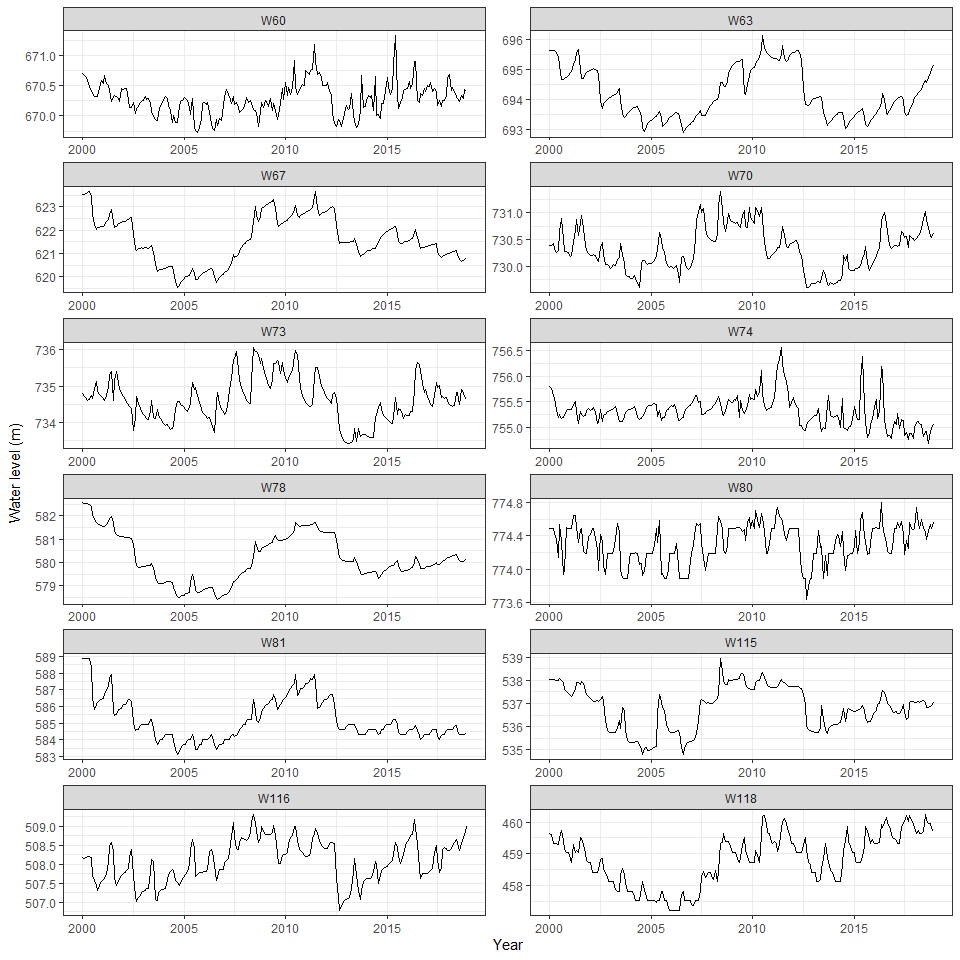
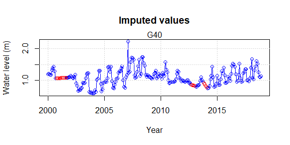
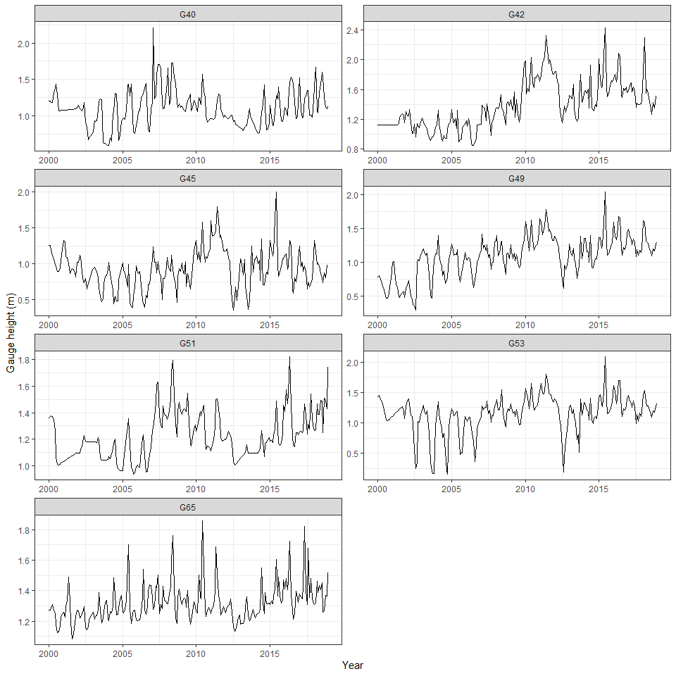
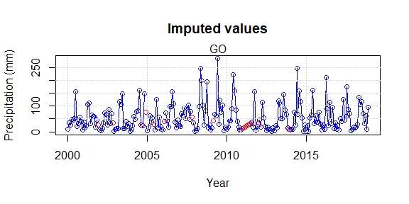
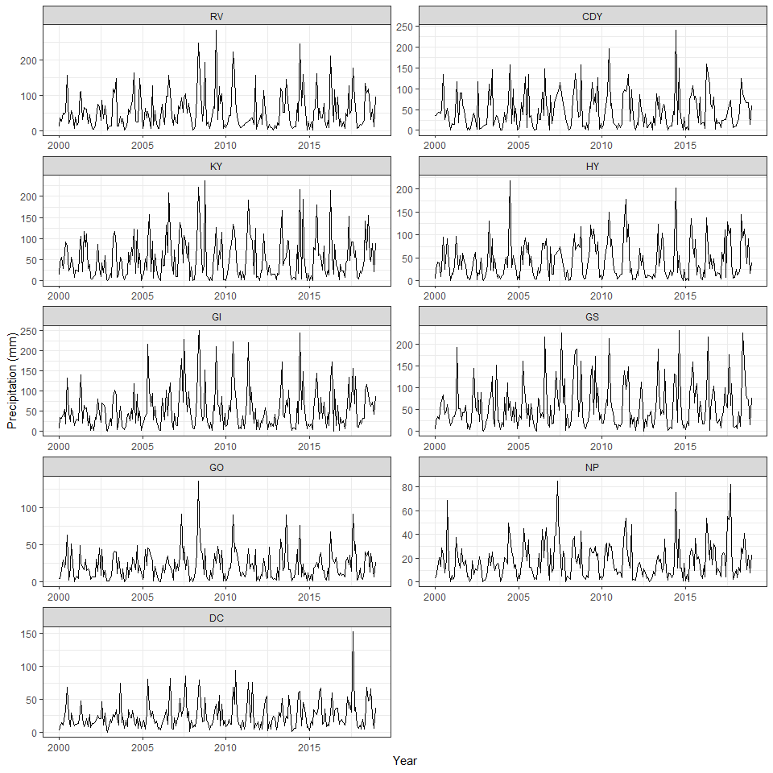
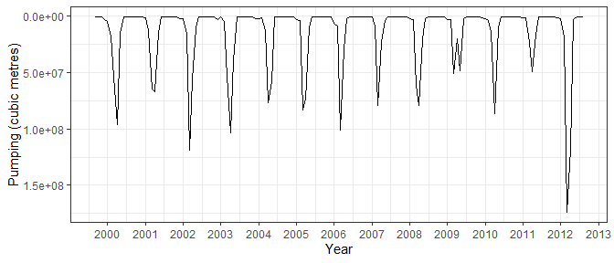

Groundwater levels
==================

Groundwater levels were obtained from [United States Geological Survey
(USGS) National Groundwater Monitoring
Network](https://cida.usgs.gov/ngwmn/) for Platte River Basin in
Nebraska from 2000 to 2018. 12 groundwater wells were selected based on
data available, and screen depth. Read the data containing groundwater
levels with missing values:

    ##         Date      W60      W63      W67      W70      W73      W74      W78
    ## 1 1-Jan-2000 2200.452 2282.330 2045.680 2396.298 2410.710 2479.669 1911.284
    ## 2 1-Feb-2000 2200.377 2282.340 2045.752 2396.306 2410.502 2479.520 1911.228
    ## 3 1-Mar-2000 2200.238 2282.334 2045.837 2396.404 2410.327 2479.101 1911.197
    ## 4 1-Apr-2000 2200.110 2282.341 2045.960 2396.086 2410.142 2478.879 1911.148
    ## 5 1-May-2000 2199.762 2282.123 2046.076 2395.895 2410.179 2478.191 1911.110
    ## 6 1-Jun-2000 2199.552 2281.595 2045.607 2395.996 2410.572 2477.632 1910.794
    ##        W80    W81     W115     W116     W118
    ## 1 2541.000 1932.0 1765.232 1667.225 1508.000
    ## 2 2541.000 1932.0 1765.202 1667.190 1507.862
    ## 3 2541.000 1932.0 1765.205 1667.298 1507.000
    ## 4 2540.774 1932.0 1765.192 1667.375 1507.000
    ## 5 2540.548 1932.0 1765.112 1667.318 1507.000
    ## 6 2539.839 1930.5 1765.068 1667.260 1506.871

Count the missing values

    ## Date  W60  W63  W67  W70  W73  W74  W78  W80  W81 W115 W116 W118 
    ##    0    1    3    0    0    1    2    0    0    0    4    4    1

Imputation of missing values and visualization of data
------------------------------------------------------

The missing values in the data are imputed using na\_interp command in
forecast package(Hyndman et al. [2020](#ref-R-forecast)). In this
command, for seasonal series, a robust STL decomposition is first
computed. Then a linear interpolation is applied to the seasonally
adjusted data, and the seasonal component is added back. Moritz et al.
([2015](#ref-moritz2015comparison)) compared interpolation methods and
found that this method gave the least error.

    ## Registered S3 method overwritten by 'quantmod':
    ##   method            from
    ##   as.zoo.data.frame zoo

    ## Time Series:
    ## Start = 1 
    ## End = 6 
    ## Frequency = 1 
    ##        W60      W63      W67      W70      W73      W74      W78      W80
    ## 1 2200.452 2282.330 2045.680 2396.298 2410.710 2479.669 1911.284 2541.000
    ## 2 2200.377 2282.340 2045.752 2396.306 2410.502 2479.520 1911.228 2541.000
    ## 3 2200.238 2282.334 2045.837 2396.404 2410.327 2479.101 1911.197 2541.000
    ## 4 2200.110 2282.341 2045.960 2396.086 2410.142 2478.879 1911.148 2540.774
    ## 5 2199.762 2282.123 2046.076 2395.895 2410.179 2478.191 1911.110 2540.548
    ## 6 2199.552 2281.595 2045.607 2395.996 2410.572 2477.632 1910.794 2539.839
    ##      W81     W115     W116     W118
    ## 1 1932.0 1765.232 1667.225 1508.000
    ## 2 1932.0 1765.202 1667.190 1507.862
    ## 3 1932.0 1765.205 1667.298 1507.000
    ## 4 1932.0 1765.192 1667.375 1507.000
    ## 5 1932.0 1765.112 1667.318 1507.000
    ## 6 1930.5 1765.068 1667.260 1506.871

Here is a plot of the points interpolated in one of the time series.

    ## 
    ## Attaching package: 'dplyr'

    ## The following objects are masked from 'package:stats':
    ## 
    ##     filter, lag

    ## The following objects are masked from 'package:base':
    ## 
    ##     intersect, setdiff, setequal, union

Stream gauge height data
========================

Stream gauge heights were obtained from [USGS National Water Information
System (NWIS)](https://waterdata.usgs.gov/nwis) for Platte River Basin
in Nebraska from 2000 to 2018. There were 12 gauge stations in the study
area that contained data in the aforementioned period with some missing
values. The stream gauge height data are given such as:

    ##     Date      G40 G42      G43      G44      G45      G46      G47      G48
    ## 1 Jan-00 3.938065  NA 4.830968 1.380645 4.130000 3.326452 3.266452 2.903636
    ## 2 Feb-00 3.950000  NA 4.835862 1.380000 4.120690 3.374828 3.332593 2.877143
    ## 3 Mar-00 3.872581  NA 4.547097 1.380000 3.939032 3.262258 3.213226 2.871290
    ## 4 Apr-00 3.892000  NA 3.925667 1.380000 3.678000 3.106667 3.042333 2.687667
    ## 5 May-00 4.330000  NA 5.302258 2.486129 3.471935 2.926774 2.846129 2.569355
    ## 6 Jun-00 4.515000  NA 5.566667 2.852000 3.262000 2.766667 2.706000 2.416333
    ##        G49      G51      G53      G65
    ## 1 2.579355 4.456774 4.669355 4.177097
    ## 2 2.623103 4.493103 4.745769 4.182069
    ## 3 2.561290 4.521111 4.646452 4.227419
    ## 4 2.361000 4.496333 4.515000 4.302667
    ## 5 2.136129 4.428387 4.308710 4.159677
    ## 6 1.943333 4.157000 3.956667 4.114667

Now, the missing values in the time series are give in percentage of the
number of observations in each time series.

    ##       G40       G42       G43       G44       G45       G46       G47       G48 
    ##  8.333333  7.017544  9.649123 40.350877  0.000000 39.912281 40.350877 40.350877 
    ##       G49       G51       G53       G65 
    ##  0.877193 12.719298  4.824561  0.877193

Imputation of missing values and visualization of data
------------------------------------------------------

Out of the 12 gauge stations, seven stations were selected based on the
percentage of missing values.Interpolation was carried out using
na\_interp to impute missing values.

    ## Time Series:
    ## Start = 1 
    ## End = 6 
    ## Frequency = 1 
    ##        G40      G42      G45      G49      G51      G53      G65
    ## 1 3.938065 3.673333 4.130000 2.579355 4.456774 4.669355 4.177097
    ## 2 3.950000 3.673333 4.120690 2.623103 4.493103 4.745769 4.182069
    ## 3 3.872581 3.673333 3.939032 2.561290 4.521111 4.646452 4.227419
    ## 4 3.892000 3.673333 3.678000 2.361000 4.496333 4.515000 4.302667
    ## 5 4.330000 3.673333 3.471935 2.136129 4.428387 4.308710 4.159677
    ## 6 4.515000 3.673333 3.262000 1.943333 4.157000 3.956667 4.114667

Here is a plot of the points interpolated in one of the time series.

Here are plots of stream gauge heights after imputations.

    ## # A tibble: 1,596 x 3
    ## # Groups:   Date, GaugeSt [1,596]
    ##    Date       GaugeSt  GgHt
    ##    <date>     <fct>   <dbl>
    ##  1 2000-01-01 G40      1.20
    ##  2 2000-02-01 G40      1.20
    ##  3 2000-03-01 G40      1.18
    ##  4 2000-04-01 G40      1.19
    ##  5 2000-05-01 G40      1.32
    ##  6 2000-06-01 G40      1.38
    ##  7 2000-07-01 G40      1.44
    ##  8 2000-08-01 G40      1.29
    ##  9 2000-09-01 G40      1.07
    ## 10 2000-10-01 G40      1.07
    ## # ... with 1,586 more rows

Precipitation data
==================

Stream gauge heights were obtained from [USGS National Water Information
System (NWIS)](https://waterdata.usgs.gov/nwis) for Platte River Basin
in Nebraska from 2000 to 2018. There were 12 gauge stations in the study
area that contained data in the aforementioned period with some missing
values. The stream gauge height data are given such as:

    ##   Ravenna..RV. Canaday.steam.plant..CDY. Kearney.4..KY. Hayes.Center.1NW..HY.
    ## 1         0.41                        NA           0.53                  0.17
    ## 2         1.37                      1.39           1.79                  0.97
    ## 3         1.07                      1.62           2.19                  1.61
    ## 4         1.95                      1.73           1.12                  1.54
    ## 5         1.81                      1.60           2.68                  0.39
    ## 6         2.03                      1.95           3.63                  1.04
    ##   Grand.Island.Central.NE.Regional.AP..GI. Gresham.3W..GS. Gothenberg..GO.
    ## 1                                     0.25            0.18            0.16
    ## 2                                     1.35            0.96            0.18
    ## 3                                     1.32            1.33            0.65
    ## 4                                     1.60            1.10            1.15
    ## 5                                     2.19            2.61            0.76
    ## 6                                     0.70            2.69            1.00
    ##   North.Platte.Exp.Farm David.City
    ## 1                  0.12       0.10
    ## 2                  0.18       0.34
    ## 3                  0.46       0.58
    ## 4                  0.81       0.42
    ## 5                  0.52       1.07
    ## 6                  1.12       1.29

Now, the missing values in the time series are give in percentage of the
number of observations in each time series.

    ##         RV        CDY         KY         HY         GI         GS         GO 
    ##  7.4561404 11.4035088  0.8771930  2.1929825  0.4385965  0.4385965  1.3157895 
    ##         NP         DC 
    ##  1.3157895  0.4385965

Imputation of missing values and visualization of data
------------------------------------------------------

Out of the 12 gauge stations, seven stations were selected based on the
percentage of missing values. Interpolation was carried out using
na\_interp to impute missing values.

    ## Time Series:
    ## Start = 1 
    ## End = 6 
    ## Frequency = 1 
    ##     RV  CDY   KY   HY   GI   GS   GO   NP   DC
    ## 1 0.41 1.39 0.53 0.17 0.25 0.18 0.16 0.12 0.10
    ## 2 1.37 1.39 1.79 0.97 1.35 0.96 0.18 0.18 0.34
    ## 3 1.07 1.62 2.19 1.61 1.32 1.33 0.65 0.46 0.58
    ## 4 1.95 1.73 1.12 1.54 1.60 1.10 1.15 0.81 0.42
    ## 5 1.81 1.60 2.68 0.39 2.19 2.61 0.76 0.52 1.07
    ## 6 2.03 1.95 3.63 1.04 0.70 2.69 1.00 1.12 1.29

Here is a plot of the points interpolated in one of the time series
(units changed from inches to mm).

Here are plots of stream gauge heights after imputations.

\# Pumping data The pumping data was obtained from the [CENEB
Groundwater model
report](https://dnr.nebraska.gov/CENEB-Groundwater-Model) prepared by
[Nebraska Department of Natural Resources](https://dnr.nebraska.gov/).
The time period is from Jan 2000 to Dec 2012.

    ##     Date Pumping_cubic_ft
    ## 1 Jan-00          5292734
    ## 2 Feb-00          4789253
    ## 3 Mar-00          5612045
    ## 4 Apr-00         90082913
    ## 5 May-00        150906056
    ## 6 Jun-00        623481138

The pumping plot is shown below. Please note that the y-axis has been
reversed for purpose of comparison with water levels from other
variables.

References
==========

Hyndman, Rob, George Athanasopoulos, Christoph Bergmeir, Gabriel
Caceres, Leanne Chhay, Mitchell O’Hara-Wild, Fotios Petropoulos, Slava
Razbash, Earo Wang, and Farah Yasmeen. 2020. *Forecast: Forecasting
Functions for Time Series and Linear Models*.
<https://CRAN.R-project.org/package=forecast>.

Moritz, Steffen, Alexis Sardá, Thomas Bartz-Beielstein, Martin
Zaefferer, and Jörg Stork. 2015. “Comparison of Different Methods for
Univariate Time Series Imputation in R.” *arXiv Preprint
arXiv:1510.03924*.
